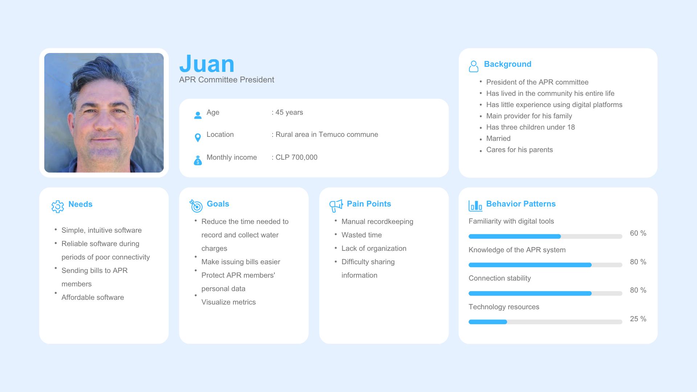
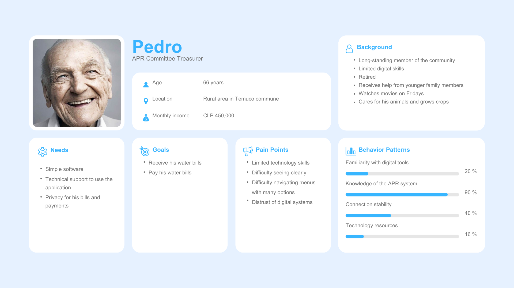
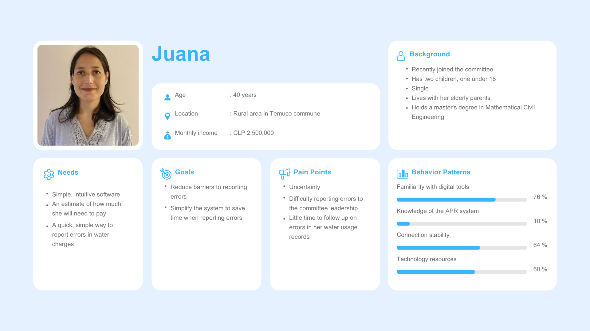
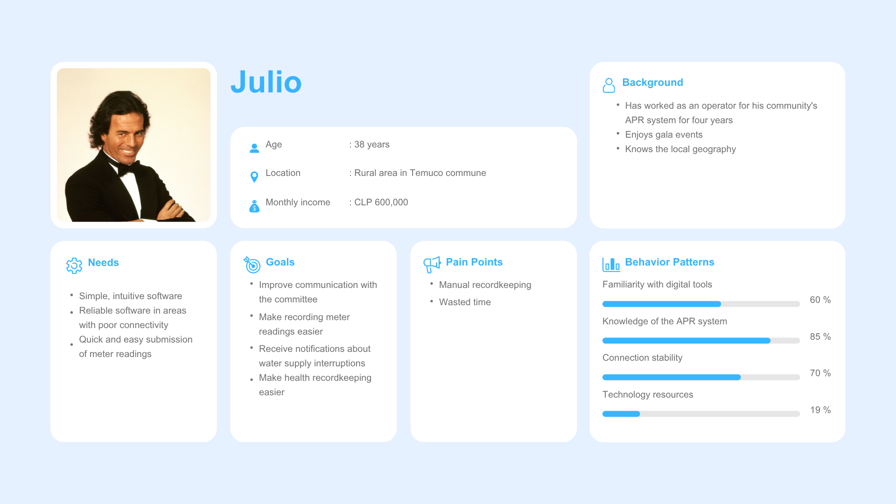
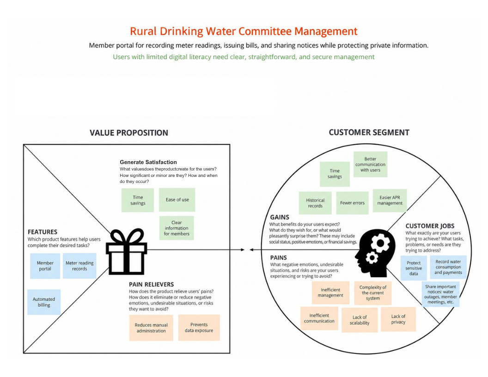

# H2Organize

User Experience Design for Rural Drinking Water Committee Management.

## Table of Contents

- [1. Introduction](#1-introduction)
  - [1.1. Problem](#11-problem)
  - [1.2. Solution](#12-solution)
  - [1.3. Team and Roles](#13-team-and-roles)
- [2. Strategy and Scope](#2-strategy-and-scope)
  - [2.1. UX Personas](#21-ux-personas)
  - [2.2. Value Proposition Canvas](#22-value-proposition-canvas)

## 1. Introduction

### 1.1. Problem
Rural Drinking Water (APR - Agua Potable Rural) committees are vital, community-driven organizations responsible for extracting, treating, and distributing water in remote areas unserved by large utility companies. Operating as a state-supported public policy for over 60 years, there are currently more than 2,400 operational APR systems across Chile. These systems are much more than just infrastructure; they represent a fundamental pillar for health, equity, economic development, and social justice, providing essential water and sanitation access to over 2.2 million rural residents.

However, despite their massive scale and critical importance, the daily administration of these systems—including meter readings, billing, service cutoffs, assemblies, and tracking overdue payments—remains largely manual and paper-based, relying heavily on the efforts of volunteer local leaders.

Transitioning this outdated management system to a digital platform presents two distinct User Experience challenges:

* Disparate Digital Literacy: There is a technological gap between the committee board (administrators) and the cooperative members (consumers). Because many rural residents face digital illiteracy, any technological solution must drastically minimize friction and leverage familiar communication tools to ensure successful adoption.

* Social Data Sensitivity: In small, tight-knit localities, the design object is inherently collective. The way community information is handled and displayed has direct social consequences. The system must guarantee strict privacy so that sensitive data, such as a neighbor's overdue debts, is never exposed to the broader community.

### 1.2. Solution
H2Organizer is a digital management platform designed specifically to address the administrative and social realities of Rural Drinking Water (APR) committees. Our goal is to streamline the committee's workload while providing an accessible, friction-less experience for all community members, regardless of their digital literacy levels.

The proposed solution operates on two main fronts, supported by a familiar communication channel:

* Administrative Web Dashboard (For the Board): A centralized web platform that allows the committee leaders to easily manage daily operations. This includes tools for recording monthly meter measurements, maintaining an updated member directory, tracking overall water consumption, and generating billing statements efficiently.

* Private Member Portal (For the Community): A secure, simplified access point where individual members can view their personal consumption data and access a payment gateway. This ensures transparency and autonomy while strictly protecting each user's financial privacy from the rest of the community.

* Frictionless Notifications (WhatsApp Integration): To bridge the digital divide, H2Organizer will leverage WhatsApp as its primary notification system. Since WhatsApp is already the established and trusted tool for coordination in these rural communities, using it for automated alerts (such as new bills, payment reminders, or service updates) drastically reduces the learning curve and ensures critical information reaches everyone.

### 1.3. Team and Roles
* Francisco Lizama → Project Manager
* Gabriel Valenzuela → UX Researcher
* José Francisco Saldias → QA Specialist

## 2. Strategy and Scope

The strategy for H2Organize is centered on bridging the digital divide in rural communities while ensuring absolute data privacy. Our scope focuses on developing essential administrative and communication features that deliver immediate value without overwhelming users who have limited technological resources. To aling our decisions with actual community needs, we researched the user base and mapped their requirements

### 2.1. UX Personas

** Persona 1: Juan **

As the president and main provider for his family, Juan has lived in the rural Temuco community his entire life and carries the heavy burden of keeping the system operational. Despite his deep of knowledge of the APR system, he has a very little experience using digital platforms. His major pain points are manual recordkeeping and the resulting wasted time. He needs simple, affordable software that remains reliable during periods of poor conectivity to reduce the time spent recording and collecting water charges.

** Persona 2: Pedro ** 

Pedro represents the elderly segment of the community; he is retired, has limited digital skills, and relies on younger family members for assistance. His greatest frustrations stem from his limited technology skills, difficulty seeing clearly, and a general distrust of digital systems. Furthermore, he struggles to navigate menus with many options. For Pedro, the system must provide simple software with technical support, ensuring strict privacy for his bills and payments.

** Persona 3: Juana **

Holding a master's degree in Mathematical Civil Engineering, Juana represents users with high digital literacy. Her pain points revolve around the uncertainty of her bills, the difficulty in reporting errors to the committee leadership, and having little time to follow up on her water usage records. She requires simple, intuitive software that provides payment estimates and a quick way to report errors in water charges to save time.

** Persona 4: Julio **

Julio has worked as the system operator for four years and directly faces the challenges of fieldwork. His main pain points are manual recordkeeping and wasted time. He needs simple and intuitive software that is reliable in areas with poor connectivity to allow for the quick and easy submission of meter readings. His broader goals include improving communication with the committee, making health recordkeeping easier, and receiving notifications about water supply interruptions.

### 2.2. Value Proposition Canvas

The "Value Proposition Canvas" ensured that the features of H2Organize directly address the frustrations of our Personas while delivering tangible benefits

** Customer Profile ** 
- Customer Jobs: The users are trying to protect sensitive data, record water consumption and payments, and share important notices such as water outages or member meetings.
- Pains: Currently, users experience negative situations related to inefficient management and communication. They are heavily frustrated by the complexity of the current system, its lack of scalability, and a significant lack of privacy.
- Gains: Users expect and wish for time savings, the creation of historical records, and easier APR management. They also expect the system to produce fewer errors and provide better communication with users.

** Value Map ** 
- Features To address the customer jobs, the product includes a member portal, meter reading records, and an automated billing system.
- Pain Relievers: The software directly relieves user frustrations because it reduces manual administration and preventes data exposure.
- Generate Satrisfaction: The product creates value and satisfaction by delivering significant time savings, ease of use, and clear information for members.
